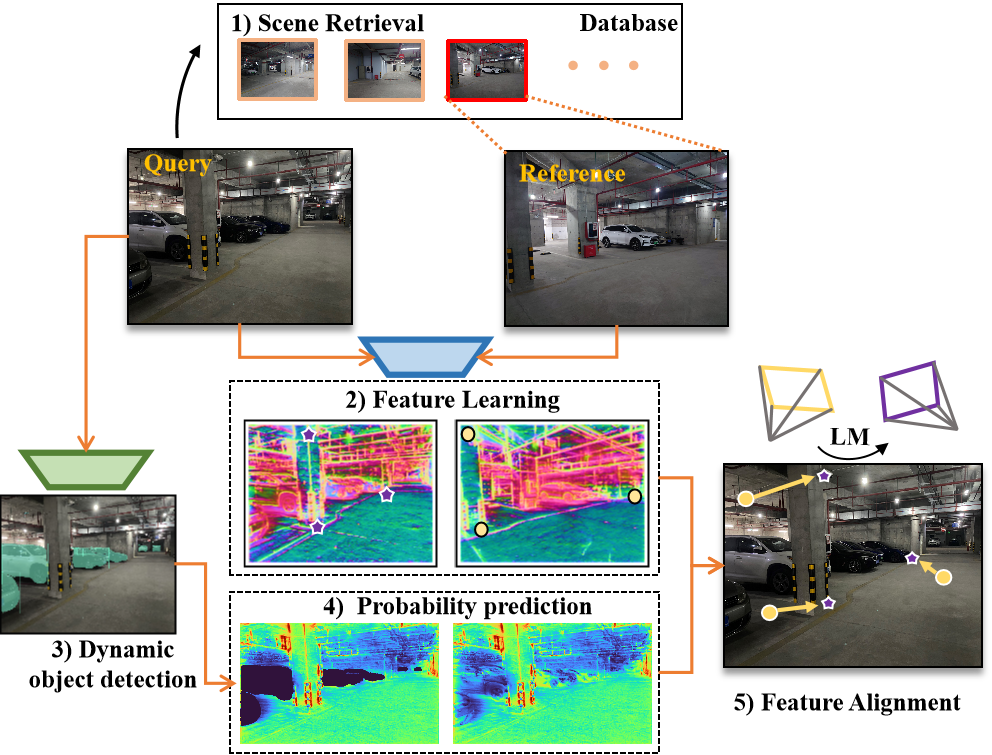
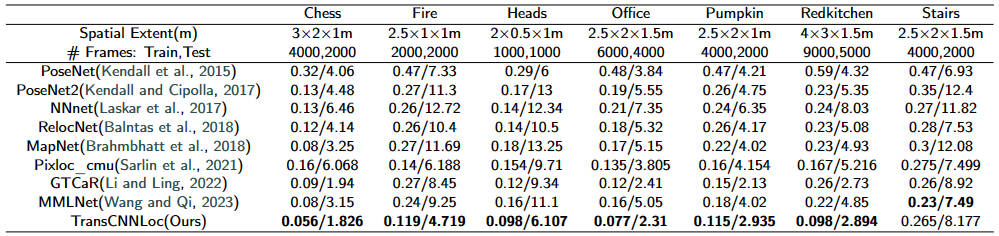

# TransCNNLoc: End-to-End Pixel-level Learning for 2D-to-3D Pose Estimation in Dynamic Indoor Scenes

We propose the TransCNNLoc framework, which consists of an encoding-decoding network designed to **learn more robust image features** for camera pose estimation. 

- Submitted to ISPRS Journal of Photogrammetry and Remote Sensing
- Authors: Shengjun Tang<sup>*</sup>, **Yusong Li<sup>\*</sup>**, Jiawei Wan, You Li, Baoding Zhou, Renzhong Guo, Weixi Wang, Yuhong Feng

<p align="center">
  
</p>

## Results
The experimental results demonstrate that the proposed TransCNNLoc framework exhibits superior adaptability to dynamic scenes and lighting changes, achieving the
best localization accuracy in all 7scenes datasets, with sub-10cm level accuracy.
<p align="center">
  
</p>

## Installation
Installing the package locally also installs the minimal dependencies listed in <span style="background-color: lightgray">requirements.txt</span>:
```
git clone https://github.com/Geelooo/TransCNNloc.git
cd TransCNNloc/
pip install -e .
```


## Data Preparation

我们通过settings.py和run_sripts.py来指定文件目录
[第三方依赖](https://drive.google.com/file/d/1pN3UVUmFwVBbtjbwc4bbUJ2hMVSH15ku/view?usp=sharing)需要提前下载
我们既使用了公开数据集7Scenes和[自采数据](https://drive.google.com/file/d/1HrsrM5lpSFMHiy1KnnGmgiGAGnl3XxOH/view?usp=sharing),
通过
```
python -m run_sripts --scene=jiawei_cheku
```
To run and evaluate position accuracy.
- <span style="background-color: lightgray">--scenet</span> parameter can be used to specify different datasets. 

The dataset should be organized according to the specified format mentioned above. Adjust the paths in the configuration file accordingly and evaluate different datasets as needed.

## License

This project is licensed under the Apache 2.0 License - see the [LICENSE](LICENSE) file for details.


## Acknowledgements

Part of the code implementation was adapted from [Pixloc's repository](https://github.com/cvg/pixloc).

<!-- Please consider citing our work if you use any of the ideas presented the paper or code from this repo:

```
@misc{du2023asymformer,
      title={AsymFormer: Asymmetrical Cross-Modal Representation Learning for Mobile Platform Real-Time RGB-D Semantic Segmentation}, 
      author={Siqi Du and Weixi Wang and Renzhong Guo and Shengjun Tang},
      year={2023},
      eprint={2309.14065},
      archivePrefix={arXiv},
      primaryClass={cs.CV}
}
``` -->